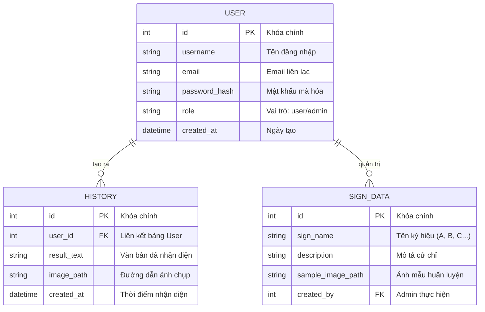

```mermaid
erDiagram
    USER ||--o{ HISTORY : "tạo ra"
    USER ||--o{ SIGN_DATA : "quản trị"

    USER {
        int id PK "Khóa chính"
        string username "Tên đăng nhập"
        string email "Email liên lạc"
        string password_hash "Mật khẩu mã hóa"
        string role "Vai trò: user/admin"
        datetime created_at "Ngày tạo"
    }

    HISTORY {
        int id PK "Khóa chính"
        int user_id FK "Liên kết bảng User"
        string result_text "Văn bản đã nhận diện"
        string image_path "Đường dẫn ảnh chụp"
        datetime created_at "Thời điểm nhận diện"
    }

    SIGN_DATA {
        int id PK "Khóa chính"
        string sign_name "Tên ký hiệu (A, B, C...)"
        string description "Mô tả cử chỉ"
        string sample_image_path "Ảnh mẫu huấn luyện"
        int created_by FK "Admin thực hiện"
    }
```
